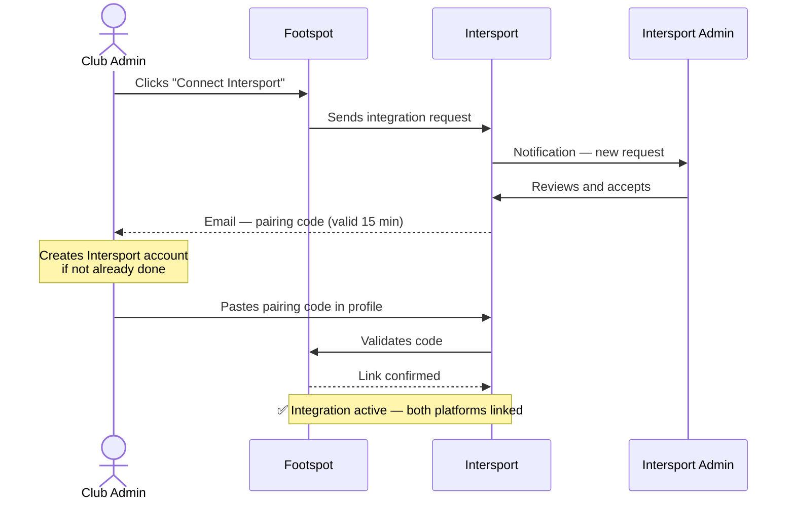
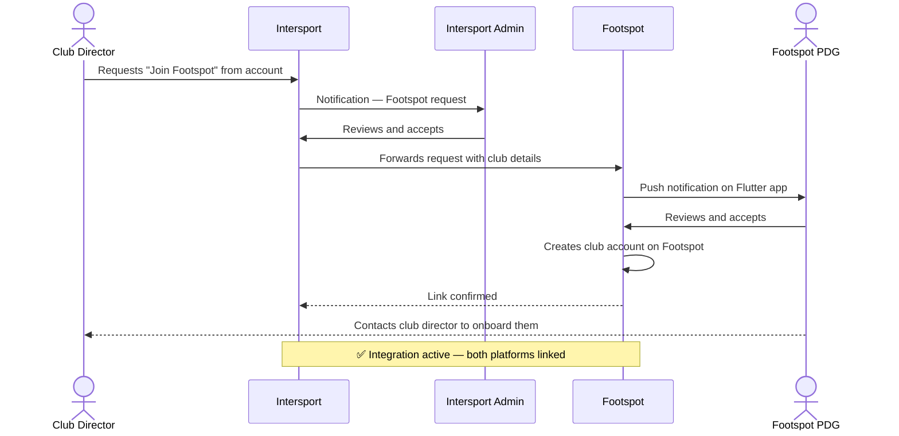
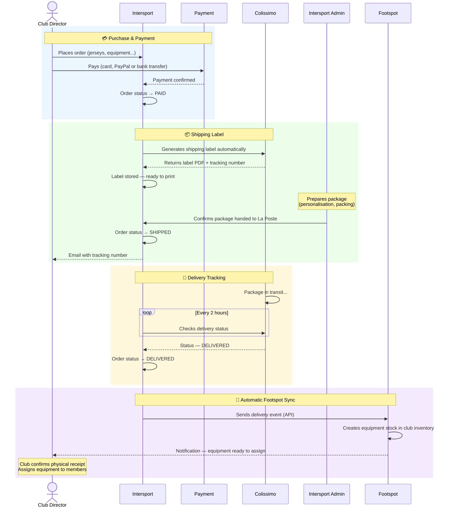
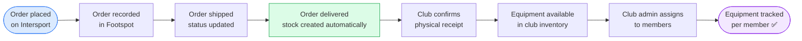
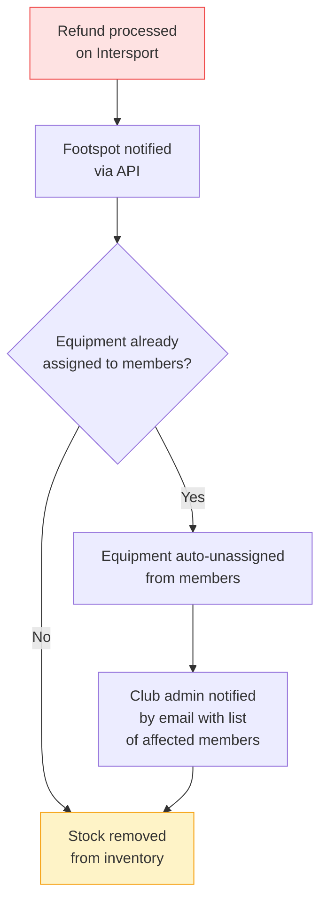

# Intersport × Footspot — Integration Overview

> Document for client review — Intersport & Footspot teams  
> Purpose: validate the full integration process before development begins

---

## What This Integration Does

When a soccer club buys equipment on Intersport and has a Footspot account, the purchase is **automatically synchronized** into their Footspot inventory — no manual entry needed. Equipment appears in Footspot the moment it is delivered, ready for the club to assign to its members.

Clubs that buy on Intersport and manage their squad on Footspot get a complete flow: from online purchase to per-member equipment assignment, with full traceability.

---

## Two Ways to Activate the Integration

| | Flow 1 | Flow 2 |
|---|---|---|
| **Club situation** | Already on Footspot | Not yet on Footspot |
| **Who initiates** | Club admin (from Footspot) | Club director (from Intersport) |
| **Footspot PDG involved** | No | Yes — creates the club |

---

## Flow 1 — Club Already on Footspot

---

## Flow 2 — Club Does Not Have Footspot

---

## Purchase → Delivery → Footspot Sync

*This flow is identical for both Flow 1 and Flow 2 clubs once the integration is active.*

---

## What Each Side Handles

### Intersport
- Order management and payment processing
- Automatic Colissimo label generation after payment
- Shipping confirmation and customer tracking emails
- Automatic push to Footspot on delivery

### Footspot
- Receives the delivery event and creates the equipment stock automatically
- Club admin confirms physical receipt and activates the items
- Club assigns equipment to members using existing Footspot flows
- Full traceability: which item, which order, which season, assigned to whom

---

## Equipment Lifecycle in Footspot After Sync

---

## Refund Flow

If an order is refunded on Intersport, Footspot is notified automatically:

---

## Security at a Glance

- Every API call between Intersport and Footspot is **signed** — no call can be forged
- Each club has its own **unique access token** — revoking one club's access does not affect others
- Duplicate event protection — the same order can never be created twice in Footspot
- All sensitive keys are stored encrypted — never exposed in the app or database

---

## Key Benefits per Stakeholder

| Stakeholder | Benefit |
|---|---|
| **Club director** | Zero manual entry — equipment appears in Footspot automatically after delivery |
| **Club admin (Footspot)** | Full purchase history and equipment traceability without leaving Footspot |
| **Intersport** | Stronger club loyalty, commission on Footspot subscriptions, full sales analytics |
| **Footspot** | New club acquisition channel, richer data on club purchasing behaviour |
| **Intersport warehouse** | Label printed directly from the back-office — no need to log into Colissimo website |
